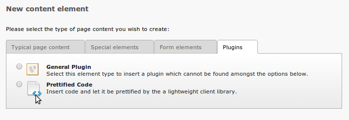
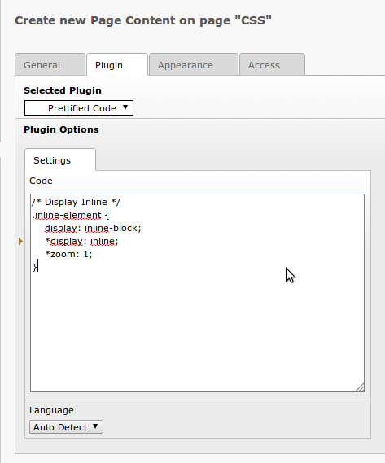
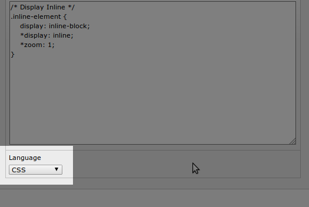
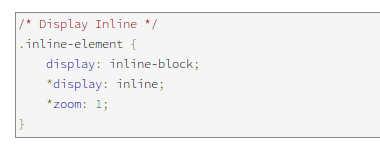

============================
Frontend
============================

Target group: **Editors** and **Integrators**

Frontend Plugin
===============

The most simple way of creating a prettified code sample is to use the frontend plugin.

	.. important::

		Use proper indentions and variable names, since re-formating obfuscated code is out of scope of this extension.

		Create a new content element and select "Prettified Code" in the "Plugins" tab.

		Insert some code.

		Optionally you can select a language.

		If the desired language is not listed or not selected, it will make an intelligent guess. This will work fine in the majority of cases.

		The result will be displayed right away.

Typoscript cObject
=======================

If you want to pretty print some code via typoscript, you can simply copy the **lib.tx_googlecodeprettify** object and change the properties:

* settings.code (Will contain the displayed code)
* *optional* settings.language (The language used, not the full name but a common abbrivation like "js" for "Javascript")

Example:
________

::

	page.100 < lib.tx_googlecodeprettify
	page.100.settings.code (
		/* Display Inline */
		.inline-element {
			display: inline-block;
			*display: inline;
			*zoom: 1;
		}
	)

	# Optionally
	page.100.settings.language = css
